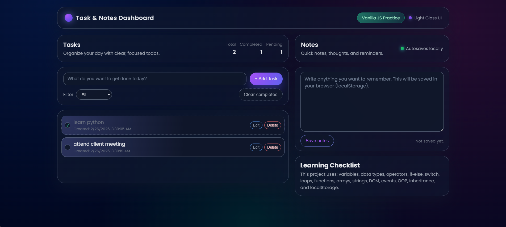

# Task & Notes Dashboard

A modern, glassmorphism‑styled **Task & Notes Dashboard** built with vanilla JavaScript, HTML, and CSS.  
It combines a todo list and a notes editor, and is designed as a **concept revision project** to practice core JavaScript topics like DOM, events, functions, arrays, OOP, and localStorage. 

---

## 🚀 Live Demo

>

```text
https://vishnuwebz.github.io/js-dashboard/
```

## 📸 Screenshots




✨ Features
Task Management

Add, edit, delete tasks.

Mark tasks as completed / pending.

Filter by All / Completed / Pending.

Live stats: total, completed, pending.

Notes Widget

Rich text area for quick notes and reminders.

Notes saved in browser using localStorage (no backend).

“Last saved” time indicator.

Modern UI

Glassmorphism card layout with soft shadows and blur.

Responsive layout for desktop and mobile.

Subtle animations and hover effects for buttons and list items. 

Fully Client‑Side

No frameworks, no build tools.

Just open index.html in a browser and it works.

Tech Stack
Frontend: HTML5, CSS3 (Glassmorphism design, responsive layout)

Logic: Vanilla JavaScript (no frameworks)

Storage: Browser localStorage 

Deployment: GitHub Pages (static hosting)

## 📸 Screenshots


